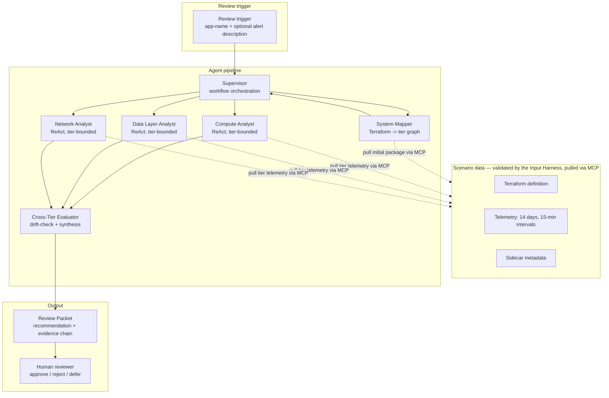
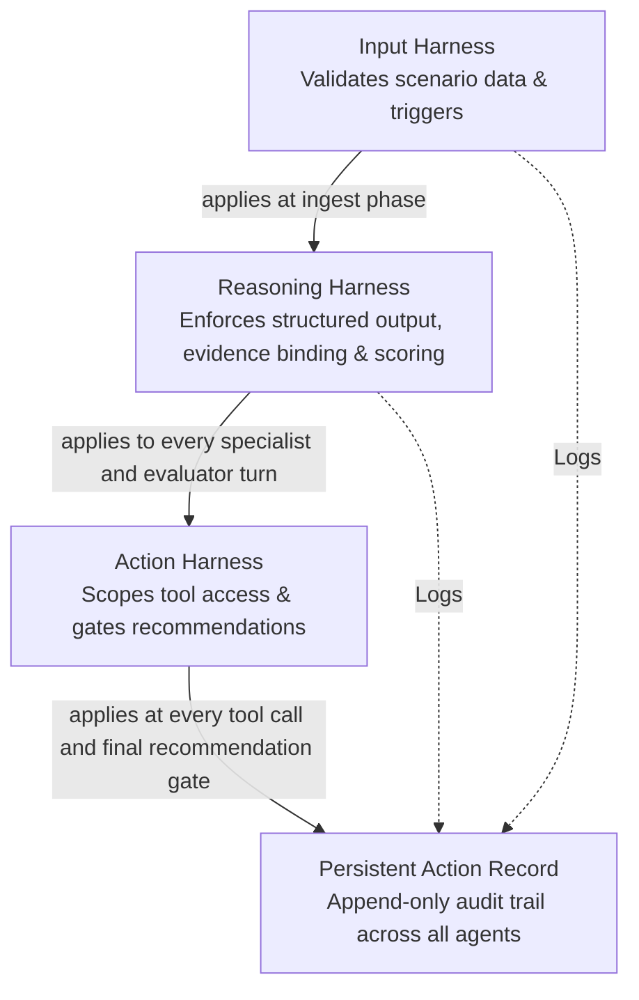
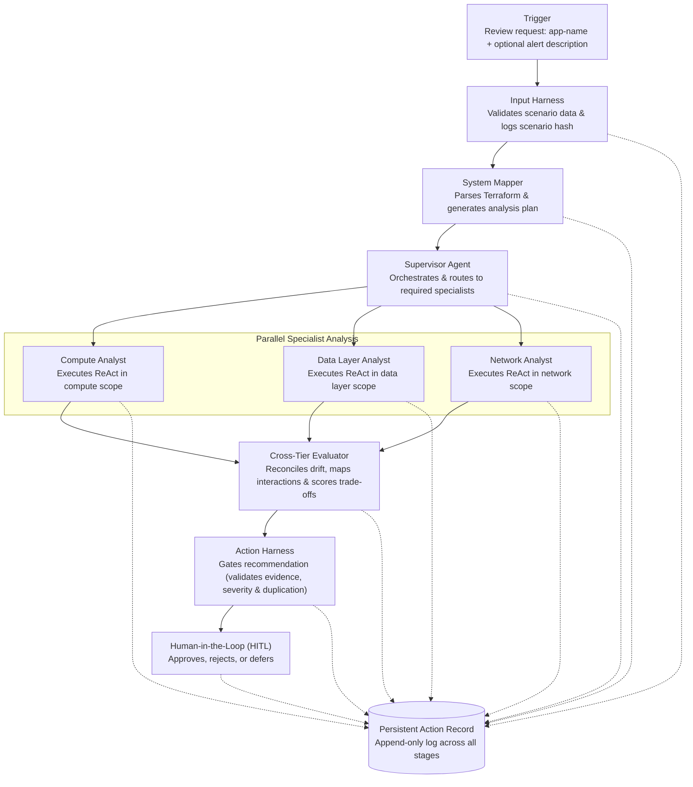
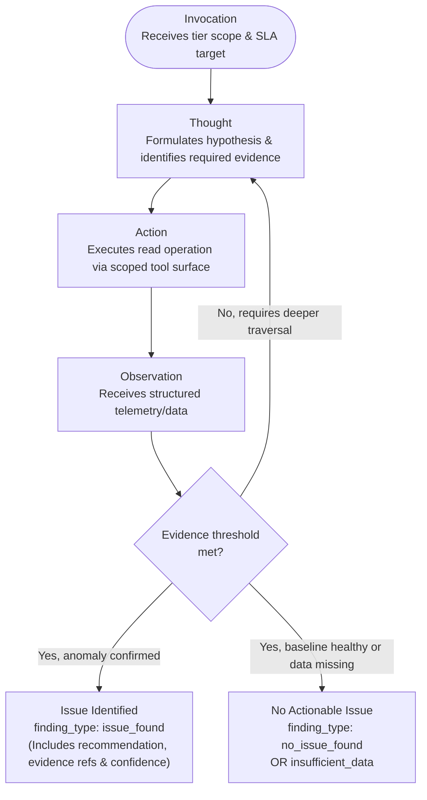

# Architecture

This file is the **how**. The **why** lives in the [README](README.md) under "The problem" — read that first if you have not. The three constraints the problem imposes (auditability, cross-tier causation, and zero-execution) are what every choice below answers.

Two structural concerns sit perpendicular to each other here:

**Agent topology**, who reasons about what, in what sequence.
**Harness layering**, what structure, safety, and observability properties run across every agent.

- Per-agent detail lives in [docs/agents.md](docs/agents.md). 
- Per-harness detail lives in [docs/harnesses.md](docs/harnesses.md).

## Design principles

Seven commitments shape every other decision.

1. **Recommender, not executor** The system never changes infrastructure state. Every recommendation routes to a human.
2. **Multi-agent by necessity** Earned, not decorative. Each agent owns a strictly bounded scope. Specialists analyze deeper because their read surface is narrow. If a single agent tries to process compute, network, and database telemetry all at once, it loses focus and outputs shallow analysis. The hierarchical network (Supervisor, Specialists, Evaluator) structurally enforces these strict boundaries.
3. **Accountability over adversarial defense** Because the system takes no external user input, prompt injection is not a meaningful threat. Our failure modes focus entirely on reasoning quality, consistency, and auditability.
4. **Deliberate synthetic data** Establishing strict ground truth requires hand-crafted scenarios. The dataset is published at [`ameau01/synthesized-cloud-optimization-recommendations`](https://huggingface.co/datasets/ameau01/synthesized-cloud-optimization-recommendations) on Hugging Face.
5. **Harnesses provide properties, not defenses** Harness layers are designed to enforce structure, safety, and observability. They are not a checklist of security defenses mapped against hypothetical threats.
6. **Model specialization over scale** We use Haiku for the high-volume, bounded specialist turns, and Sonnet for the single, complex Evaluator synthesis. Cost and capability are matched exactly to the workload.
7. **Trade-offs are part of the deliverable** Every architectural decision has rejected alternatives. That reasoning is explicitly tracked in [docs/decisions.md](docs/decisions.md).

The deeper rationale for each principle is in [docs/decisions.md](docs/decisions.md) and the sections below.

## System Overview



Every arrow crosses one or more harnesses — the next section describes them.

## The Four Harnesses

The harnesses are not a fifth agent. They are system-wide constraints enforced across the agents themselves and the data they read and produce.


The Persistent Action Record captures state at every transition, so the full reasoning chain — from trigger to final synthesis — can be reconstructed from the audit trail.

## End-to-end Flow


A review initiates with a lightweight trigger naming the target app and an optional alert description. The Supervisor pulls the initial package to plan the review, then specialists pull their tier's telemetry through the MCP surface as they reason. The Persistent Action Record captures state at every transition. The full reasoning chain, from trigger to final synthesis, can be reconstructed from the audit trail.

## Tier Specialist: the ReAct loop

Each specialist executes a strictly constrained ReAct loop, detailed in [docs/agents.md](docs/agents.md).



The ReAct trace is the foundation of the audit trail. While a zero-shot specialist produces a black-box verdict with nothing to audit, a ReAct specialist generates a sequence of thoughts, actions, and observations that a human reviewer can explicitly verify.

To prevent the agent from hallucinating or biasing toward inventing problems just to fulfill its mandate, the `finding_type` enum strictly enforces three terminal states: `issue_found`, `no_issue_found`, and `insufficient_data`.

## Cross-Tier Evaluator

The Evaluator has three sub-steps in sequence:

```mermaid
flowchart TB
    %% Node Definitions
    IN(["Input Payload<br/>Specialist findings, up to 3, & cross-tier mapping"] )
  
    S1["Step 1: Specialist Drift-Check<br/>Validates evidence binding<br/>Identifies internal contradictions<br/>Flags unsupported claims"]
  
    S2["Step 2: Cross-Tier Interaction Mapping<br/>Identifies conflicting optimizations<br/>Maps compound effects & cross-tier dependencies"]
  
    S3["Step 3: Synthesis & Trade-off Scoring<br/>Scores cost, performance & reliability<br/>Generates final recommendation & evaluator confidence"]
  
    OUT(["Final Synthesis Output<br/>Balanced action plan, trade-off matrix, evaluator confidence,<br/>drift verdicts, & per-specialist contribution trace"])

    %% Execution Flow
    IN --> S1 --> S2 --> S3 --> OUT
```
**Drift-check first, then synthesize** A contradictory or weakly bound specialist finding must not pollute cross-tier reasoning. It is isolated and flagged before the synthesis layer can combine it with the other findings.

**Correlated multi-specialist drift** A failure mode where all three specialists confidently hallucinate in the same direction is not caught by the Evaluator. By design, this edge case is structurally delegated to the Human-in-the-Loop (HITL) review. The persistent audit trail provides the trace the reviewer needs to adjudicate the correlated failure. See [docs/harnesses.md](docs/harnesses.md).

## Where Each Harness Applies

| Execution Stage | Input Harness | Reasoning Harness | Action Harness | Persistent Action Record |
| --- | --- | --- | --- | --- |
| **Trigger & Ingest** | Validates scenario data: schema, completeness, timestamp continuity | - | - | Logs trigger & scenario hash |
| **System Mapper** | Validates Terraform parsing | Enforces architecture model schema | - | Logs architecture model & analysis plan |
| **Supervisor Decisions** | - | - | - | Logs routing & invocation decisions |
| **Tier Specialist ReAct** | - | Enforces structured reasoning, evidence binding & confidence scoring | Scopes the MCP read surface to the specialist's tier | Logs every tool call & reasoning step |
| **Cross-Tier Evaluator** | - | Enforces drift-check, synthesis & trade-off scoring | - | Logs drift verdicts, scores & synthesis |
| **Final Recommendation Gate** | - | - | Gates well-formedness, evidence, severity & duplication | Logs final gate verdict |
| **HITL Decision** | - | - | - | Logs human approval, rejection, or deferral |

The Reasoning Harness carries the heaviest cognitive load. The Action Harness remains intentionally narrow. The Persistent Action Record maintains state across the entire lifecycle. The Input Harness acts strictly as the front door.

## What This Architecture Is Not

**Not a microservice deployment diagram** The system runs as a single Python process for the portfolio implementation. The architectural boundaries are logical, not infrastructural.

**Not a state-machine specification** LangGraph (or an equivalent framework) handles the strict control flow. The diagrams above describe the conceptual reasoning structure, not the exact state transitions.

**The Supervisor is not a simple router** It makes active workflow decisions: which specialists to invoke based on the analysis plan, when to retry a specialist on low confidence, and when to defer to a human reviewer.

**The Cross-Tier Evaluator is not a winner-picker** When specialist findings conflict, the Evaluator does not silently discard one side. Instead, it explicitly surfaces the tension, maps the dependencies, and scores the trade-offs for the reviewer.