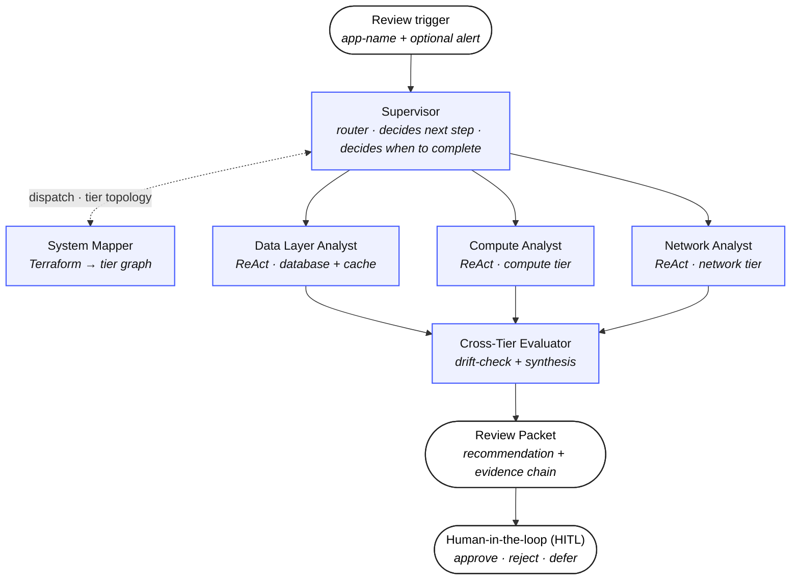
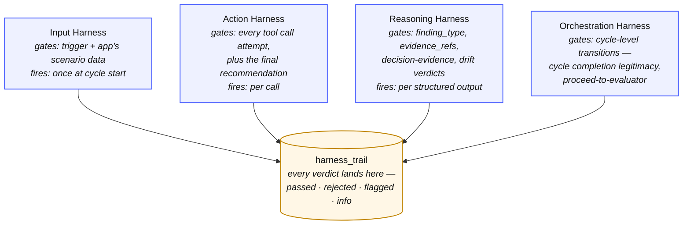
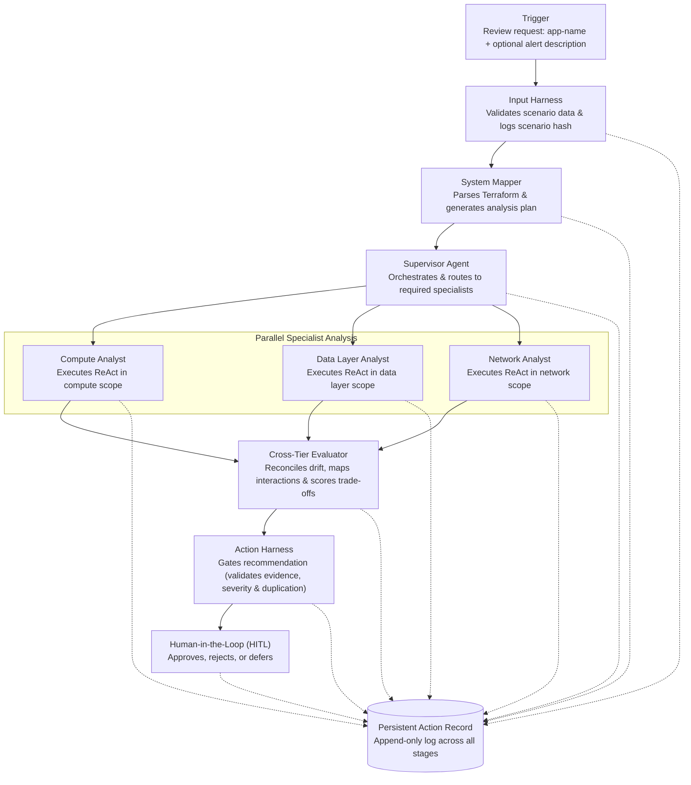
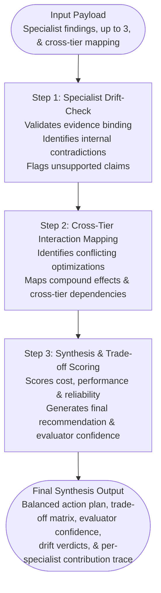

# Architecture

This file is the **how**. The **why** lives in the [README](README.md) under "The problem" — read that first if you have not. The three constraints the problem imposes (auditability, cross-tier causation, and zero-execution) are what every choice below answers.

Two structural concerns sit perpendicular to each other here:

**Agent topology**, who reasons about what, in what sequence.
**Harness layering**, what structure, safety, and observability properties run across every agent.

- Per-agent detail lives in [docs/agents.md](docs/agents.md). 
- Per-harness detail lives in [docs/harnesses.md](docs/harnesses.md).

## Design principles

Seven commitments shape every other decision.

1. **Recommender, not executor** The system never changes infrastructure state. Every recommendation routes to a human.
2. **Multi-agent by necessity** Earned, not decorative. Each agent owns a strictly bounded scope to ensure deep analysis. A single agent processing all telemetry at once produces shallow results. Our hierarchical network structurally enforces these narrow boundaries.
3. **Accountability over adversarial defense** Since the system takes no external user input, prompt injection is not a threat. We focus entirely on reasoning quality, consistency, and auditability.
4. **Deliberate synthetic data** Establishing strict ground truth requires hand-crafted scenarios. The dataset is published at [`ameau01/synthesized-cloud-optimization-recommendations`](https://huggingface.co/datasets/ameau01/synthesized-cloud-optimization-recommendations) on Hugging Face.
5. **Harnesses provide properties, not defenses** Harness layers are designed to enforce structure, safety, and observability. They are not a checklist of security defenses mapped against hypothetical threats.
6. **Model specialization over scale** We use Haiku for the high-volume, bounded specialist turns, and Sonnet for the single, complex Evaluator synthesis. Cost and capability are matched exactly to the workload.
7. **Trade-offs are part of the deliverable** Every architectural decision has rejected alternatives. That reasoning is explicitly tracked in [docs/decisions.md](docs/decisions.md).

The deeper rationale for each principle is in [docs/decisions.md](docs/decisions.md) and the sections below.

## System Overview

*Blue boxes are agents; oval endpoints are external boundaries (trigger in, deliverable out, human review). MCP scenario data and the four harnesses are cross-cutting concerns covered by the diagrams further down.*

**Reading the diagram.** The vertical sequence — trigger, Supervisor, three tier-bounded Specialists in parallel, Cross-Tier Evaluator, Review Packet, Human-in-the-loop — is the conceptual flow of one review cycle. The Supervisor fans out to the three Specialists whose tiers the System Mapper detected; their findings fan back in to the Cross-Tier Evaluator for drift-check and synthesis. The fan-out / fan-in shape is the coordination story — many independent specialist agents, one synthesized conclusion. System Mapper sits perpendicular because the Supervisor dispatches it once per cycle to map the application's tier graph, then control returns to the Supervisor — it's a worker the Supervisor calls, not a stage in the pipeline.

**Supervisor is the only router.** Although the diagram draws the sequence as a vertical chain, the implementation routes every transition through the Supervisor: Supervisor decides whether to call System Mapper, which specialists to dispatch, when to synthesize via the Evaluator, when to hand the synthesized recommendation onward to the Action Harness gate (see the next section), and crucially — when to terminate the cycle. Every worker node returns to the Supervisor between stages; no worker can decide "we're done" on its own. The downward arrows are the conceptual sequence; the routing loop through the Supervisor is left implicit to keep the diagram readable.

Every arrow crosses one or more harnesses — the next section describes them. Note that this is a logical topology, not a microservice deployment diagram. For this portfolio implementation, the system runs as a single Python process; the architectural boundaries are strictly logical, not infrastructural.

## The Four Harnesses

The harnesses are not a fifth agent. They are system-wide constraints enforced across the agents themselves and the data they read and produce.

The harnesses are cross-cutting concerns, not a sequential pipeline — each fires at a different kind of event during one cycle. Every verdict (passed, rejected, flagged, info) lands in `harness_trail`, keyed by `check_name` and linked to the audit row it judged via `related_event_id`. The agent's substance — what it decided and what evidence it cited — lives in a separate table, `audit_records`. The two tables together let a reader reconstruct both the decision report (substance) and the enforcement report (verdicts) for any cycle. See `docs/audit-trail.md` for the table-level model and `docs/harnesses.md` for what each harness checks.

## End-to-end Flow

A review initiates with a lightweight trigger naming the target app and an optional alert description. The Supervisor pulls the initial package to plan the review, then specialists pull their tier's telemetry through the MCP surface as they reason. The Persistent Action Record captures state at every transition. The full reasoning chain, from trigger to final synthesis, can be reconstructed from the audit trail. Note that this diagram describes the conceptual reasoning structure, not a strict state-machine specification. Frameworks like LangGraph handle the actual control flow and state transitions underneath.

## Tier Specialist: the ReAct loop

Each specialist executes a strictly constrained ReAct loop, detailed in [docs/agents.md](docs/agents.md).

**Execution Boundaries:** The ReAct loop, terminal states (`issue_found` / `no_issue_found` / `insufficient_data`), and a worked cycle are detailed in [`docs/agents.md`](docs/agents.md).

## Cross-Tier Evaluator

The Evaluator has three sub-steps in sequence:

**Evaluator Logic:** The three steps run in strict sequence with drift-check first, so a weak or contradictory finding cannot pollute the final synthesis. Full mechanics and correlated-drift handling are in [`docs/agents.md`](docs/agents.md). 

## Where Each Harness Applies

| Execution Stage | Input Harness | Reasoning Harness | Action Harness | Persistent Action Record |
| --- | --- | --- | --- | --- |
| **Trigger & Ingest** | Validates scenario data: schema, completeness, timestamp continuity | - | - | Logs trigger & scenario hash |
| **System Mapper** | Validates Terraform parsing | Enforces architecture model schema | - | Logs architecture model & analysis plan |
| **Supervisor Decisions** | - | - | - | Logs routing & invocation decisions |
| **Tier Specialist ReAct** | - | Enforces structured reasoning, evidence binding & confidence scoring | Scopes the MCP read surface to the specialist's tier | Logs every tool call & reasoning step |
| **Cross-Tier Evaluator** | - | Enforces drift-check, synthesis & trade-off scoring | - | Logs drift verdicts, scores & synthesis |
| **Final Recommendation Gate** | - | - | Gates well-formedness, evidence, severity & duplication | Logs final gate verdict |
| **HITL Decision** | - | - | - | Logs human approval, rejection, or deferral |

The Reasoning Harness carries the heaviest cognitive load. The Action Harness remains intentionally narrow. The Persistent Action Record maintains state across the entire lifecycle. The Input Harness acts strictly as the front door.
