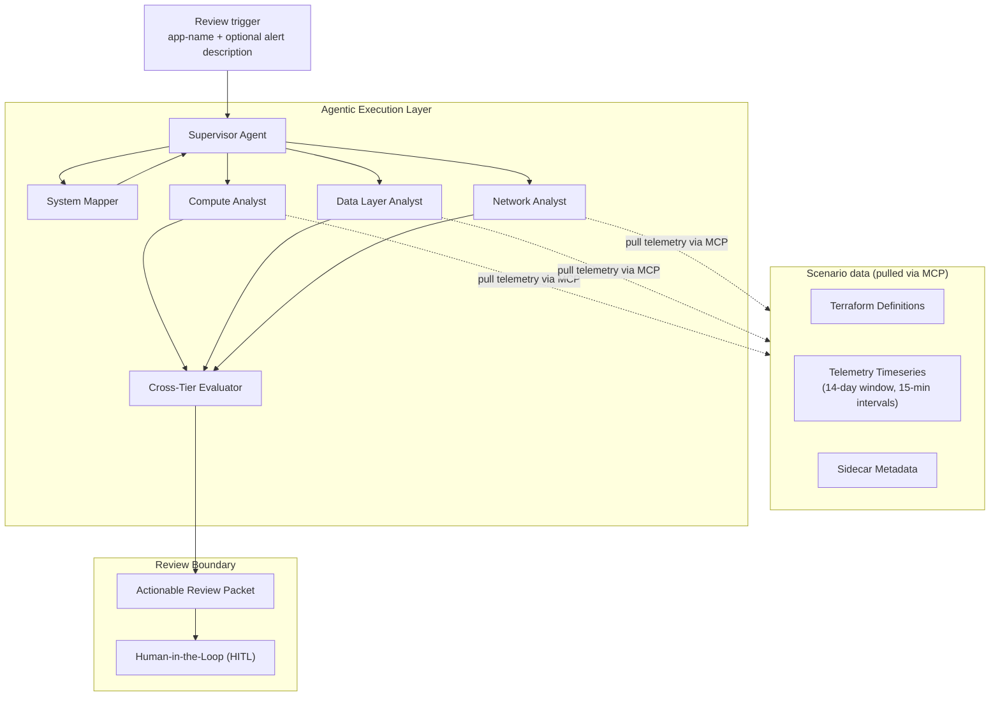

# Multi-Agent Cloud-Optimization Recommender

[](https://huggingface.co/datasets/ameau01/synthesized-cloud-optimization-recommendations)
[](LICENSE)
[](pyproject.toml)


**v1.0.0**
- Design documentation complete (architecture, agents, harnesses, MCP contract, audit trail, evaluation, decisions). 

**Trust the recommendation because you can trace it, not because you trust the model.**

This is a multi-agent system that analyzes cloud telemetry and recommends infrastructure optimizations with structurally auditable reasoning. Three specialist agents independently analyze compute, database, and network. A cross-tier evaluator then reconciles their findings, drift-checks each one, and weighs the cost, performance, and reliability trade-offs — keeping the three separate rather than collapsing them into a single number.

Every recommendation is evidence-bound: each claim traces back to the specific observation that produced it. The system prepares the full reasoning trail and hands it to a human reviewer. It recommends; it never changes infrastructure state — a human stays in the loop for every action.

The point is the auditable trail, not the verdict. A reviewer doesn't have to take the recommendation on faith. They can follow any claim back to the evidence, and a recommendation whose evidence doesn't resolve never reaches them in the first place.

## The problem

Cloud optimization is hard because the service screaming the loudest is rarely the one causing the problem. When an alert fires in a distributed system, the hard part is tracing it back to the real root cause. Application latency spikes look like a compute problem until you find the slow database queries. Connection pool exhaustion appears to be a database problem until you see that the load came from a compute auto-scaling event.

A single agent can’t diagnose this complex problem well. If you force an LLM to be an expert in compute, databases, and networks all at once, it reasons shallowly across them. To make the matter worse, a single agent tends to latch onto whichever signal it saw first and rationalize a plausible-sounding cause, rather than run an independent, tier-scoped investigation that each domain needs. Show it CPU metrics when the real issue is a network egress bottleneck, and it will more often explain the CPU than question the framing. Splitting the reasoning by tier and giving each agentic specialist its own scoped view of the data is what makes a real diagnosis possible.

## Three constraints, one architecture

Three constraints drive every architectural choice that follows:

1. **Recommendations must be transparent.** Every claim is anchored in evidence, and the reasoning chain can be replayed forward or backward.
2. **The diagnosis must hold up across tiers** — because the cause often sits in a different tier than the symptom. Specialists analyze independently, then an evaluator reconciles them with the wider view.
3. **The system must never act on its own** — so it surfaces recommendations to a human and stops there. The Action Harness stays narrow.

Key design decisions that follow from those constraints:

- **Multi-agent over single ReAct** One agent reasoning over all tiers at once trades depth for breadth. Bounded agents in a hierarchy keep each specialist's read surface narrow, which lets each one analyze deeper.
- **ReAct, not zero-shot** A zero-shot specialist's audit record is "input in, output out." A ReAct specialist's record is a trace of thoughts, actions, and observations that a human can review.
- **An MCP read surface, scoped per tier** Each specialist's telemetry access is a Model Context Protocol toolset limited to its own tier — a compute specialist cannot query database metrics. Scope is enforced at the tool surface, not by asking the agent nicely.
- **Relational audit trail, not vector** The access patterns are foreign-key traversal and structured queries, not similarity search.
- **Two LLM tiers** Haiku for specialists (many small ReAct turns). Sonnet for the Evaluator (one hard synthesis call per review). Matches model cost to where capability actually matters.
- **Narrow Action Harness** The system is a recommender. Inflating the harness with execution would dilute the identity and invite a conflict of interest.

The architecture is the direct response to these constraints: six agents in a hierarchy, governed by four cross-cutting harnesses (evidence-binding, auditability, scope discipline, and replayability). The system operates on zero internal trust: the Evaluator explicitly drift-checks every specialist. The human does not trust the agents; they trust the audit trail, because every step of the reasoning is traceable to the evidence that produced it.

Full per-decision reasoning, and the alternatives rejected, lives in
[`docs/decisions.md`](docs/decisions.md).


## Architectural Diagram



A review begins with a trigger naming the target app — optionally with the alert's description — not a telemetry payload. Because nothing is handed in, the agents pull what they need:

- **Parallel, independent specialists** Three Tier Specialists run concurrently, each pulling data on demand through its own MCP read surface. They share no cross-tier visibility. This strict isolation is exactly what gives the Evaluator's subsequent drift-check its structural integrity.
- **Three specialists, four tiers** The Data Layer Analyst handles both database and cache telemetry; compute and network each have their own specialist.
- **One cross-tier view** The Cross-Tier Evaluator is the only agent that sees across tiers — by design, so synthesis happens in exactly one place.


## What's in the project

- **6 agents.** Supervisor, System Mapper, three Tier Specialists, Cross-Tier Evaluator.
- **4 harnesses.** Input, Reasoning, Action, Persistent Action Record.
- **An MCP server exposing the read surface.** Specialists query telemetry through a Model Context Protocol tool surface — the scoped, per-tier read contract a specialist is allowed to see becomes its MCP toolset, so cross-tier access is structurally impossible. [`docs/mcp-server.md`](docs/mcp-server.md).
- **A published Hugging Face dataset** [`ameau01/synthesized-cloud-optimization-recommendations`](https://huggingface.co/datasets/ameau01/synthesized-cloud-optimization-recommendations). 18 scenarios, each with a hand-crafted target recommendation. The system is graded against that recommendation, not against itself.
- **A replayable audit trail** Every recommendation links back to the specific evidence that justified it.
- **A three-tier evaluator.** Floor checks structure. Mid checks keyword and multi-tier reasoning. Rich checks fixture citations plus quantified projections. Single-shot agents typically fail Rich. Orchestrated agents pass.

### Expected scores by baseline

| Baseline                                | Floor | Mid     | Rich    |
|-----------------------------------------|-------|---------|---------|
| Trivial (canned answer)                 | 1-2   | 0       | 0       |
| Random (random allowed values)          | 4-6   | 0       | 0       |
| Single-shot frontier LLM, no tools      | 18    | 12-15   | 8-12    |
| Orchestrated multi-agent (this project) | 18    | 18      | 18      |

Numbers are projections, not measurements. The gap between row three and
row four is what justifies the orchestration. See
[`docs/eval-set.md`](docs/eval-set.md) for the per-tier check definitions
and calibration discipline.

## Audit-trail walkthrough

This is the part to read.

Take scenario 08: application latency is rising and it looks like a compute problem. The right answer is to *not* scale compute — the cause is downstream, in the database. Here is what the audit trail captures, end to end.

**1. Trigger** A review request arrives. The Input Harness validates the target scenario's data (Terraform + 14 days of telemetry + sidecar metadata). The scenario hash and validation outcomes are logged.

**2. System Mapper** Parses the Terraform. Identifies tiers: compute, database, cache, network. Builds the dependency graph. Produces an analysis plan: "invoke Compute, Data Layer, and Network Analysts; check
the compute-to-database cross-tier pair."

**3. Supervisor** Reads the analysis plan. Decides which specialists to invoke. Logs the invocation manifest.

**4. Data Layer Analyst (ReAct loop).** Each `get_*` call is an MCP tool invocation against the specialist's scoped surface; the call and its result are logged.

```
Thought: Are database query latencies elevated during business hours?
Action:  get_summary_statistics(app_name='app-08', tier='database', metric='db_query_p95_latency_ms')
Observation: {p50: 195, p90: 480, p95: 660, mean: 244, windowed_max: 820}
Thought: Elevated. Are specific queries dominating?
Action:  get_top_queries(app_name='app-08', limit=10)
Observation: {queries_above_300ms: 6, top_query_p95_ms: 820}
Thought: Six slow queries. Are connection pools saturating?
Action:  get_time_pattern(app_name='app-08', tier='database', metric='connection_pool_usage_pct')
Observation: {p95: 88.0, peak_window_count: 14, pattern: 'business_hours_saturation'}
Finding: issue_found, "optimize the top 6 queries; add 2 read replicas
         with read/write splitting" (expected +$540/mo, p95 660ms → under 220ms)
```

**5. Compute Analyst** Runs its own ReAct loop. CPU p95 is stable at 27%; application latency tracks database latency, not compute load. Concludes `no_issue_found` — and explicitly does not recommend scaling.

**6. Network Analyst** Sub-millisecond latency, negligible packet loss.
`no_issue_found`.

**7. Cross-Tier Evaluator.** Runs three sub-steps:

- **Drift-check.** Does each finding follow from its cited evidence? Verdicts: all `tight`.
- **Cross-tier interactions** `correlation_evidence.json` shows database latency *leads* application latency by 15 minutes (coefficient 0.945). This is a downstream cascade: compute is the symptom, the database is the cause.
- **Synthesis.** The database finding is the only actionable claim. Trade-offs scored separately: cost up (+$540/mo for read replicas), performance up (66% p95 reduction), reliability up (SLA restored). Evaluator confidence: high.

**8. Action Harness** Gates the recommendation. Checks well-formedness, evidence completeness (every cited reference resolves to a logged observation), severity, duplication. Verdict: pass. A recommendation with a dangling evidence reference would fail here and never reach the human.

**9. HITL** The review packet is surfaced: recommendation, evidence chain, two levels of confidence, drift-check verdicts. The reviewer can drill into any record.

The full chain is `reviews -> supervisor_decisions -> specialist_steps -> specialist_findings -> evaluator_drift_checks -> evaluator_records -> action_harness_gate_records -> review_packets -> hitl_decisions`. Walk it forward or backward — either direction reconstructs the recorded reasoning. (Replay reconstructs what happened; it does not re-derive answers by re-running the model. See [`docs/audit-trail.md`](docs/audit-trail.md).)

Full architecture and flow detail lives in [`ARCHITECTURE.md`](ARCHITECTURE.md).

## Quick start

```bash
# Install
uv sync

# Fetch the dataset from Hugging Face on first run (cached after that)
python -m src.data_loader

# Run one scenario end-to-end
make demo

# Run the smoke test (3 scenarios)
make smoke

# Run the full eval (18 scenarios)
make eval

# Replay a scenario from the audit trail
python -m scripts.replay --scenario 8
```

The dataset lives at
[`ameau01/synthesized-cloud-optimization-recommendations`](https://huggingface.co/datasets/ameau01/synthesized-cloud-optimization-recommendations). The first run downloads it via `huggingface_hub.snapshot_download` and caches it under `~/.cache/huggingface/`. The cache is shared across projects and persists across sessions. (These commands target the built system; see the status note above for what is committed at this stage.)

## Repo map

```
.
├── README.md                          # you are here
├── ARCHITECTURE.md                    # the picture, the flow, the principles
├── docs/
│  ├── agents.md                       # what each of the six agents does
│  ├── harnesses.md                    # the four cross-cutting properties
│  ├── audit-trail.md                  # replayability and the schema
│  ├── eval-set.md                     # Floor / Mid / Rich scoring
│  ├── mcp-server.md                   # MCP read contract + dataset loading
│  └── decisions.md                    # trade-offs, alternatives, limitations
├── src/
│  ├── data_loader.py                  # fetches dataset from Hugging Face
│  ├── agents/                         # multi-agent orchestration
│  ├── harnesses/                      # input, reasoning, action, audit
│  ├── evaluator/                      # Floor + Mid + Rich tier scorer
│  └── mcp_server/                     # MCP tool surface implementation
├── examples/
│  └── sample_scenario/                # one full scenario for quick inspection
└── tests/
    └── fixtures/                      # 1-2 vendored scenarios for unit tests
```

The 18 scenarios are not in the repo. They are pulled at runtime from the Hugging Face dataset linked above. The local cache makes repeat runs fast.

## A note on scope

The dataset is 18 scenarios. Telemetry is synthesized, not observed. Before/after evidence is fabricated. The system runs locally with no AWS account.

These are deliberate choices, not gaps. Ground truth requires synthetic data — every scenario has a known correct recommendation, which real telemetry would not. A portfolio project that needs a cloud bill to demo is the wrong shape.

The trade-offs are written down honestly in [`docs/decisions.md`](docs/decisions.md) (the "Limitations" half of that doc). A reviewer who wants to know what a production extension would add — real telemetry, closed-loop feedback, multi-application reasoning — will find it there.

## License

MIT.

## Citation

```
@misc{multi_agent_cloud_optimization_recommender_2026,
  title  = {Multi-Agent Cloud-Optimization Recommender},
  author = {Alexander Meau},
  year   = {2026},
  version = {1.0.0}
}
```
