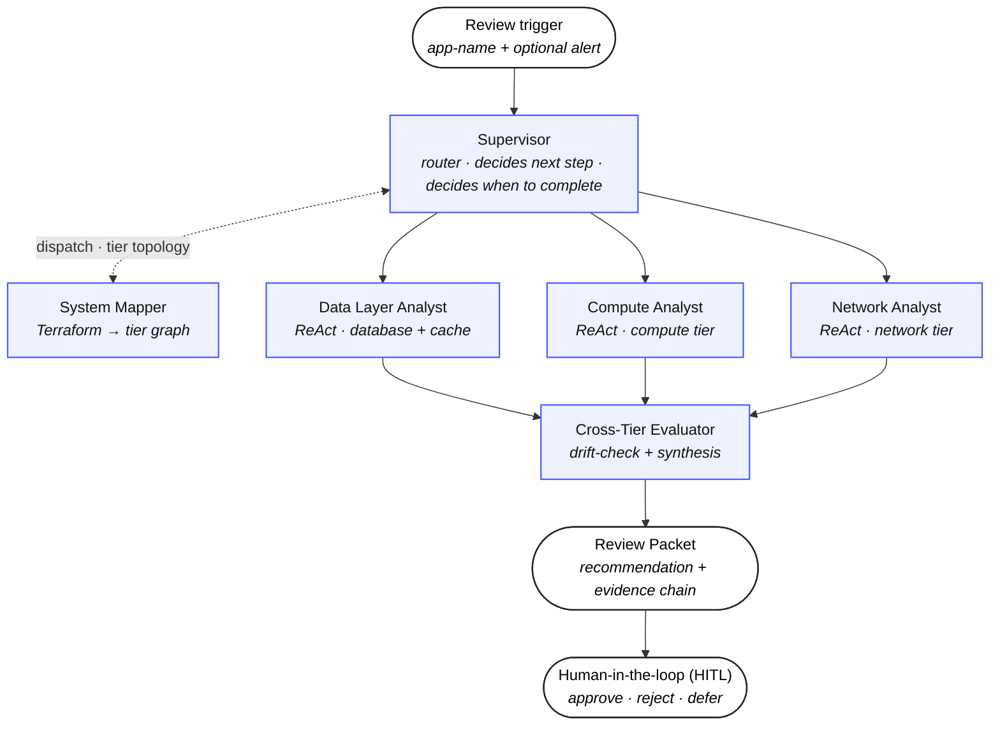

# Auditable Multi-Aagent Recommender

[](https://huggingface.co/datasets/ameau01/synthesized-cloud-optimization-recommendations)
[](LICENSE)
[](pyproject.toml)
[](https://github.com/ameau01/auditable-multi-agent-recommender/actions/workflows/lint-typecheck-test.yml)
[](https://github.com/astral-sh/uv)
[](https://github.com/astral-sh/ruff)

> **Trust the recommendation because you can trace it, not because you trust the model.**

This is a multi-agent system that analyzes cloud telemetry and recommends infrastructure optimizations with structurally auditable reasoning. Three specialist agents independently analyze compute, database, and network. A cross-tier evaluator then reconciles their findings, drift-checks each one, and weighs the cost, performance, and reliability trade-offs — keeping the three separate rather than collapsing them into a single number.

Every recommendation is evidence-bound: each claim traces back to the specific observation that produced it. The system prepares the full reasoning trail and hands it to a human reviewer. It recommends; it never changes infrastructure state — a human stays in the loop for every action.

The point is the auditable trail, not the verdict. A reviewer doesn't have to take the recommendation on faith. They can follow any claim back to the evidence, and a recommendation whose evidence doesn't resolve never reaches them in the first place.

## The problem

Cloud optimization is hard because the service screaming the loudest is rarely the one causing the problem. When an alert fires in a distributed system, the hard part is tracing it back to the real root cause. Application latency spikes look like a compute problem until you find the slow database queries. Connection pool exhaustion appears to be a database problem until you see that the load came from a compute auto-scaling event.

A single agent can’t diagnose this complex problem well. If you force an LLM to be an expert in compute, databases, and networks all at once, it reasons shallowly across them. To make the matter worse, a single agent tends to latch onto whichever signal it saw first and rationalize a plausible-sounding cause, rather than run an independent, tier-scoped investigation that each domain needs. Show it CPU metrics when the real issue is a network egress bottleneck, and it will more often explain the CPU than question the framing. Splitting the reasoning by tier and giving each agentic specialist its own scoped view of the data is what makes a real diagnosis possible.

## Three constraints, one architecture

Three constraints drive every architectural choice that follows:

1. **Recommendations must be transparent.** Every claim is anchored in evidence, and the reasoning chain can be replayed forward or backward.
2. **The diagnosis must hold up across tiers** — because the cause often sits in a different tier than the symptom. Specialists analyze independently, then an evaluator reconciles them with the wider view.
3. **The system must never act on its own** — so it surfaces recommendations to a human and stops there. The Action Harness stays narrow.

Key design decisions that follow from those constraints:

- **Multi-agent over single ReAct** One agent reasoning over all tiers at once trades depth for breadth. Bounded agents in a hierarchy keep each specialist's read surface narrow, which lets each one analyze deeper.
- **ReAct, not zero-shot** A zero-shot specialist's audit record is "input in, output out." A ReAct specialist's record is a trace of thoughts, actions, and observations that a human can review.
- **An MCP read surface, scoped per tier** Each specialist's telemetry access is a Model Context Protocol toolset limited to its own tier — a compute specialist cannot query database metrics. Scope is enforced at the tool surface, not by asking the agent nicely.
- **Frontier model end-to-end** Specialists run ReAct loops over rich telemetry (nested distributions, time patterns, per-instance breakouts); the Evaluator synthesizes across them. Both warrant a capable model. Models are pluggable via `.env` for cost-sensitive deployments.
- **Narrow Action Harness** The system is a recommender. Inflating the harness with execution would dilute the identity and invite a conflict of interest.

The architecture is the direct response to these constraints: six agents in a hierarchy, governed by four cross-cutting harnesses — Input, Reasoning, Action, Orchestration — that enforce evidence-binding, auditability, scope discipline, and replayability. The system operates on zero internal trust: the Evaluator explicitly drift-checks every specialist. The human does not trust the agents; they trust the audit trail, because every step of the reasoning is traceable to the evidence that produced it.

Full per-decision reasoning, and the alternatives rejected, lives in
[`docs/decisions.md`](docs/decisions.md).


## System overview



*Blue boxes are agents; oval endpoints are external boundaries (trigger in, deliverable out, human review). The four harnesses are cross-cutting concerns covered in [ARCHITECTURE.md](ARCHITECTURE.md); the data layer that specialists query is documented separately in [docs/mcp-server.md](docs/mcp-server.md).*

**Reading the diagram.** The vertical sequence — trigger, Supervisor, three tier-bounded Specialists in parallel, Cross-Tier Evaluator, Review Packet, Human-in-the-loop — is the conceptual flow of one review cycle. The Supervisor fans out to the three Specialists whose tiers the System Mapper detected; their findings fan back in to the Cross-Tier Evaluator for drift-check and synthesis. The fan-out / fan-in shape is the coordination story — many independent specialist agents, one synthesized conclusion. System Mapper sits perpendicular because the Supervisor dispatches it once per cycle to map the application's tier graph, then control returns to the Supervisor — it's a worker the Supervisor calls, not a stage in the pipeline.

**Supervisor is the only router.** Although the diagram draws the sequence as a vertical chain, the implementation routes every transition through the Supervisor: Supervisor decides whether to call System Mapper, which specialists to dispatch, when to synthesize via the Evaluator, when to hand the synthesized recommendation onward to the Action Harness gate, and crucially — when to terminate the cycle. Every worker node returns to the Supervisor between stages; no worker can decide "we're done" on its own. The downward arrows are the conceptual sequence; the routing loop through the Supervisor is left implicit to keep the diagram readable. This is a conceptual narrative of the reasoning structure — the actual control flow and state transitions are handled by LangGraph underneath.

Every arrow crosses one or more harnesses — see [ARCHITECTURE.md](ARCHITECTURE.md) for the harness layering. Note that this is a logical topology, not a microservice deployment diagram. For this portfolio implementation, the system runs as a single Python process; the architectural boundaries are strictly logical, not infrastructural.


## What's in the project

- **6 agents.** Supervisor, System Mapper, three Tier Specialists, Cross-Tier Evaluator.
- **4 harnesses.** Input, Reasoning, Action, Orchestration.
- **An MCP server exposing the read surface.** Specialists query telemetry through a Model Context Protocol tool surface — the scoped, per-tier read contract a specialist is allowed to see becomes its MCP toolset, so cross-tier access is structurally impossible. [`docs/mcp-server.md`](docs/mcp-server.md).
- **A published Hugging Face dataset** [`ameau01/synthesized-cloud-optimization-recommendations`](https://huggingface.co/datasets/ameau01/synthesized-cloud-optimization-recommendations). 18 scenarios, each with a hand-crafted target recommendation. The system is graded against that recommendation, not against itself.
- **A replayable audit trail** Every recommendation links back to the specific evidence that justified it.
- **A four-layer evaluator, two modes.** Shape and Correctness are deterministic rule-based gates: well-formed JSON, strict enum equality on finding_type, primary_tier, secondary_tier, action_category. Mid and Rich are scored by an auditable LLM judge against a published rubric: did the agent engage with the right evidence, did it produce orchestrated synthesis. Mid and Rich are gated on Correctness, so a wrong-answer prediction is reported as "wrong answer" rather than "right answer but thin." The judge can flag but cannot override the deterministic verdict.

### Measured scores by baseline

| Baseline | Shape (18) | Correctness (18) | Mid (18) | Rich (18) |
| :--- | :--- | :--- | :--- | :--- |
| Single-shot (Haiku)         | 12 | 4  | 1  | 0  |
| Single-shot (Sonnet)        | 18 | 4  | 2  | 0  |
| Single-shot (Opus)          | 18 | 3  | 1  | 0  |
| Orchestrated (Haiku)        | 18 | 9  | 6  | 5  |
| Orchestrated (Sonnet)       | 18 | 15 | 15 | 14 |
| **Orchestrated (Opus)**     | **18** | **18** | **18** | **18** |

*Real measurements (2026-06-04). Per-run summaries and methodology in [`measurements/`](measurements/). Re-runs may shift counts slightly due to LLM non-determinism.*

## Audit-trail walkthrough

This is the part to read.

Take scenario 08: application latency is rising and it looks like a compute problem. The right answer is to *not* scale compute — the cause is downstream, in the database. Here is what the audit trail captures, end to end.

**1. Trigger** A review request arrives. The Input Harness validates the target scenario's data (Terraform + 14 days of telemetry + sidecar metadata). The scenario hash and validation outcomes are logged.

**2. System Mapper** Parses the Terraform. Identifies tiers in scope: compute and database (cache and network absent in this topology). Builds the dependency graph. Produces an analysis plan: "invoke Compute and Data Layer Analysts; check the compute-to-database cross-tier pair."

**3. Supervisor** Reads the analysis plan. Decides which specialists to invoke. Logs the invocation manifest.

**4. Data Layer Analyst (ReAct loop).** Each `get_*` call is an MCP tool invocation against the specialist's scoped surface; the call and its result are logged.

```
Thought: Are database query latencies elevated during business hours?
Action:  get_summary_statistics(app_name='app-08', tier='database', metric='db_query_p95_latency_ms')
Observation: {p50: 195, p90: 480, p95: 660, mean: 244, windowed_max: 820}
Thought: Elevated. Are specific queries dominating?
Action:  get_top_queries(app_name='app-08', limit=10)
Observation: {queries_above_300ms: 6, top_query_p95_ms: 820}
Thought: Six slow queries. Are connection pools saturating?
Action:  get_time_pattern(app_name='app-08', tier='database', metric='connection_pool_usage_pct')
Observation: {p95: 88.0, peak_window_count: 14, pattern: 'business_hours_saturation'}
Finding: issue_found, "optimize the top 6 queries; add 2 read replicas
         with read/write splitting" (expected +$540/mo, p95 660ms → under 220ms)
```

**5. Compute Analyst** Runs its own ReAct loop. CPU p95 is stable at 27%; application latency tracks database latency, not compute load. Concludes `no_issue_found` — and explicitly does not recommend scaling.

**6. Network Analyst** Not invoked. Scenario 08 has no network tier (`network: None` in the topology), so the Supervisor's analysis plan skips it. The absence is logged.

**7. Cross-Tier Evaluator.** Runs three sub-steps:

- **Drift-check.** Does each finding follow from its cited evidence? Verdicts: all `tight`.
- **Cross-tier interactions** `correlation_evidence.json` shows database latency *leads* application latency by 15 minutes (coefficient 0.945). This is a downstream cascade: compute is the symptom, the database is the cause.
- **Synthesis.** The database finding is the only actionable claim. Trade-offs scored separately: cost up (+$540/mo for read replicas), performance up (66% p95 reduction), reliability up (SLA restored). Evaluator confidence: high.

**8. Action Harness** Gates the recommendation. Checks well-formedness, evidence completeness (every cited reference resolves to a logged observation), severity, duplication. Verdict: pass. A recommendation with a dangling evidence reference would fail here and never reach the human.

**9. HITL** The review packet is surfaced: recommendation, evidence chain, two levels of confidence (each specialist's own confidence in its finding, plus the Cross-Tier Evaluator's confidence in the synthesis), drift-check verdicts. The reviewer can drill into any record.

The full chain is `reviews -> supervisor_decisions -> specialist_steps -> specialist_findings -> evaluator_drift_checks -> evaluator_records -> action_harness_gate_records -> review_packets -> hitl_decisions`. Walk it forward or backward — either direction reconstructs the recorded reasoning. (Replay reconstructs what happened; it does not re-derive answers by re-running the model. See [`docs/audit-trail.md`](docs/audit-trail.md).)

See the rendered output for scenarios 02, 07, and 08 in [`sample_runs/`](sample_runs/).

Full architecture and flow detail lives in [`ARCHITECTURE.md`](ARCHITECTURE.md). Per-agent roles, prompts, and decision spaces are in [`docs/agents.md`](docs/agents.md).

## Quick start

Three paths. Full details in [`docs/running.md`](docs/running.md).

### Path A — Docker, mock mode

Needs: Docker.

```bash
docker compose up --build demo
open ./demo-output/report.md
```

Replays a vendored app-08 cycle (no LLM, no API key, no network). The rendered report carries a MOCK MODE banner. `--build` is defensive: it picks up any source/dep changes since your last run, and is a near-instant cache hit when nothing changed.

### Path B — Docker, live LLM

Needs: Docker, internet (LLM API + first-run Hugging Face dataset fetch ~12 MB), `ANTHROPIC_API_KEY` in `.env`.

```bash
cp .env.example .env && $EDITOR .env    # add ANTHROPIC_API_KEY
docker compose up --build live-llm      # runs app-08 by default
                                        # first run ~12-15 min including image build
                                        # subsequent runs ~5-10 min, ~$0.10
open ./demo-output/report.md
```

### Path C — Local, real LLM (developer)

Needs: `bash`, `uv`, internet, API key in `.env`. Optional: `LANGSMITH_API_KEY` for trace export.

```bash
uv sync
cp .env.example .env && $EDITOR .env    # add API key
make scenario APP=app-08                # agents + render + score, ~$0.10
open ./demo-output/report.md
make help                               # everything else (integration, baselines, langgraph studio, …)
```

## Repo orientation

```
.
├── README.md, ARCHITECTURE.md, CHANGELOG.md
├── docs/             design docs — agents, harnesses, audit-trail, eval-set, mcp-server, decisions
├── src/              implementation — agents, harnesses, mcp_server, evaluator, audit, renderer, models, common
├── eval-set/         18 gold answers + per-scenario scoring rubrics + demo
├── tests/            unit (fast, default) + integration (slower)
├── scripts/          wrapper scripts — run_agents, run_integration, clean, etc.
├── sample_runs/      3 worked examples (composite + rendered report + trace)
├── dataset-examples/ 3 telemetry-only scenarios (gold redacted)
└── notebooks/        walkthrough demos
```

The 18 scenarios are not in the repo. They are pulled at runtime from the Hugging Face dataset linked above and cached locally at `.hf_cache/`.

## A note on scope

The dataset is 18 scenarios. Telemetry is synthesized, not observed. Before/after evidence is fabricated. The system runs locally with no AWS account.

These are deliberate choices, not gaps. Ground truth requires synthetic data — every scenario has a known correct recommendation, which real telemetry would not. A portfolio project that needs a cloud bill to demo is the wrong shape.

The trade-offs are written down honestly in [`docs/decisions.md`](docs/decisions.md) (the "Limitations" half of that doc). A reviewer who wants to know what a production extension would add — real telemetry, closed-loop feedback, multi-application reasoning — will find it there.

## Project status

[](https://github.com/ameau01/auditable-multi-agent-recommender/releases)
[](https://github.com/ameau01/auditable-multi-agent-recommender/releases)
- Design documentation: architecture, agents, harnesses, MCP contract, audit trail, evaluation, decisions — with dataset examples.
- MCP Server with Pydantic models.
- Eval-set: 18 gold answers + the four-layer scorer (Shape / Correctness / Mid / Rich).
- Agent orchestration fully implemented, with LangGraph Studio support.
- Sample, fully-traceable reports for three scenarios in [`sample_runs/`](sample_runs/).
- Baseline measurements across multiple model tiers in [`measurements/`](measurements/).
- Demo Jupyter notebooks added in [`notebooks/`](notebooks/).

## License

MIT.

## Citation

```
@misc{auditable_multi_agent_recommender_2026,
  title  = {Auditable Multi-Agent Recommender},
  author = {Alexander Meau},
  year   = {2026},
  version = {1.0.0}
}
```
